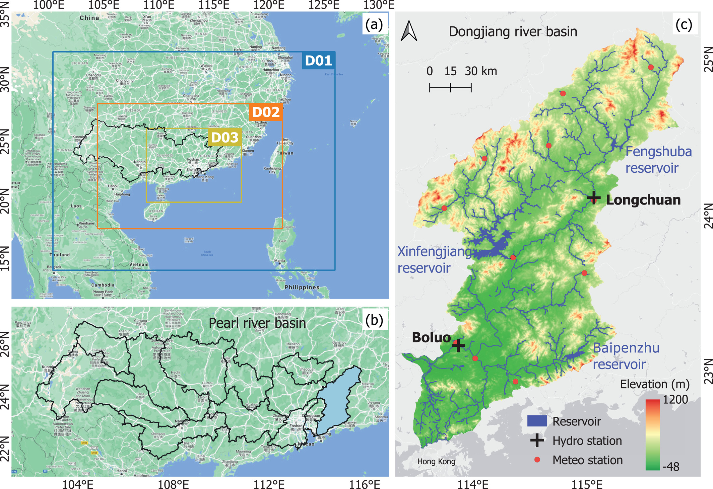

To generate high-resolution climate information for projecting future changes in hydrologic regimes, the WRF model was used to perform multi-decadal convection-permitting climate projections over the GBA. The model configuration follows a two-way triple nesting setup with the outer two domains consisting of simulations with parameterized convection (D01 and D02), and the innermost domain of a simulation with the parameterization of deep convection switched off (D03). The outermost domain D01 covers a large part of China with 68 × 56 grid points at a 36 km resolution, while the nested domain D02 is resolved at a 12-km grid spacing (138 × 96 grid points). The innermost domain D03 covers the GBA at a 4-km grid spacing (216 × 171 grid points). The vertical direction is discretized using 21 stretched model levels topped at 50 hPa.

Convection-permitting simulations were separately conducted for the historical (1980–2005) and future (2074–2099) periods to assess climate change impacts on regional hydroclimatic regimes. The historical simulation was forced by the ECMWF reanalysis product, ERA-Interim, which has a 6-hr temporal resolution and a 0.75° × 0.75° spatial resolution. The future projection was forced with the ERA-Interim reanalysis consecutively perturbed using the PGW technique and GCM ensembles. In the PGW method, the future force was given by the combination of reanalysis data and a perturbated estimation from a 30-year ensemble of 10 CMIP5 GCMs under RCP8.5.

